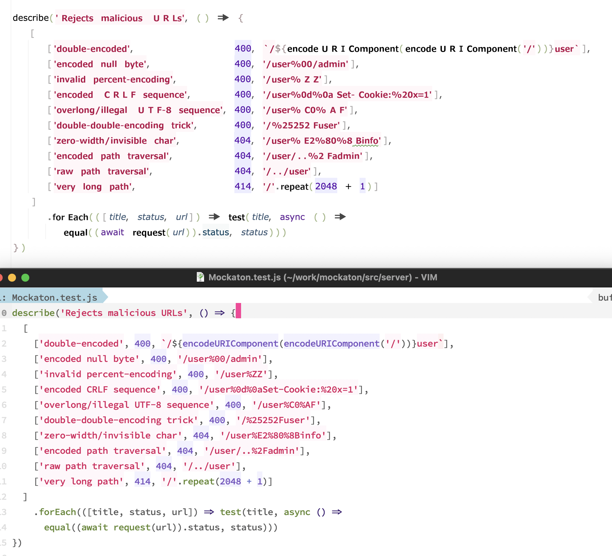
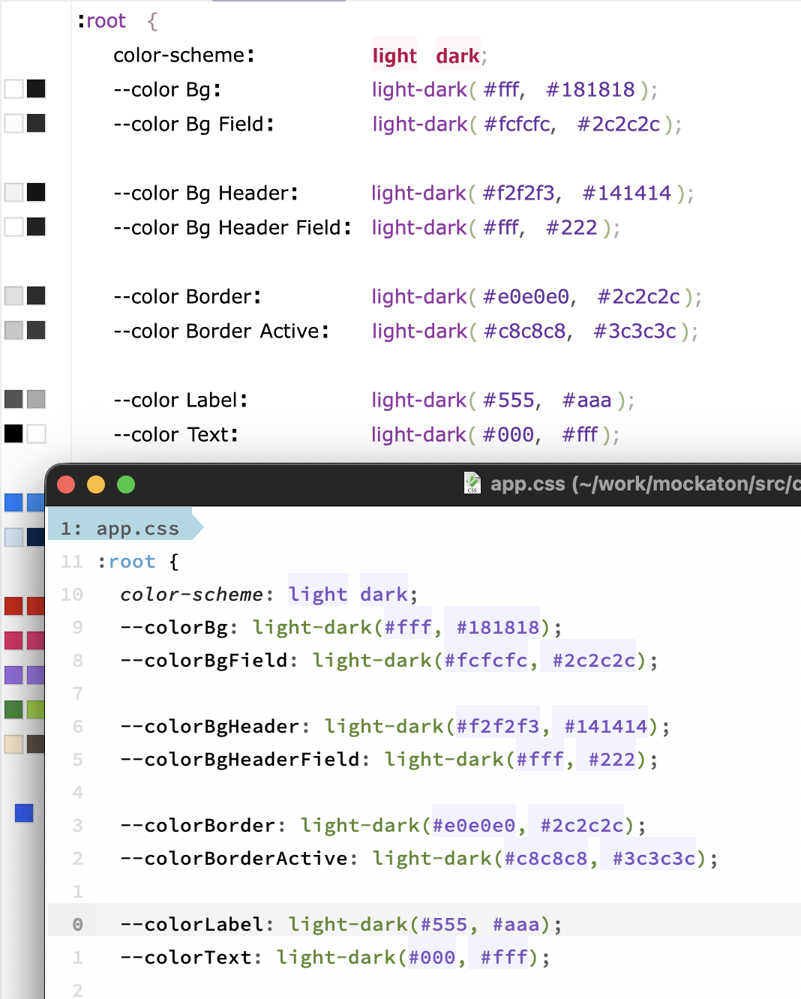

# Tabular Eye

https://plugins.jetbrains.com/plugin/31443-tabular-eye/edit

<!-- Plugin description -->
Renders certain code blocks in two columns without adding whitespace and supports proportional fonts.

- JS/TS/JSON object literals 
- JS/TS 2D arrays
- TS interfaces
- CSS properties
- Python dataclasses
- Python dictionary literals
- Python keyword args
- YAML objects
- YAML lists (for non-monospace fonts)

<!-- Plugin description end -->

## Demo

### JS


### CSS



## Credits
- https://nick-gravgaard.com/elastic-tabstops/
- JetBrains MPS decision tables
- JetBrains CSV tabular rendering

Plugin based on the [IntelliJ Platform Plugin Template][template].

[template]: https://github.com/JetBrains/intellij-platform-plugin-template

[docs:plugin-description]: https://plugins.jetbrains.com/docs/intellij/plugin-user-experience.html#plugin-description-and-presentation

---

## Development

```sh
./gradlew runIde
```

```sh
./gradlew buildPlugin
```
The resulting ZIP file will be located in:
`build/distributions/tabular-eye-1.0-SNAPSHOT.zip`
