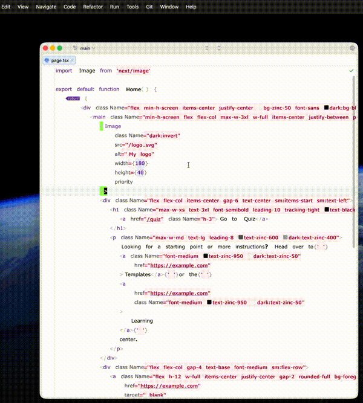
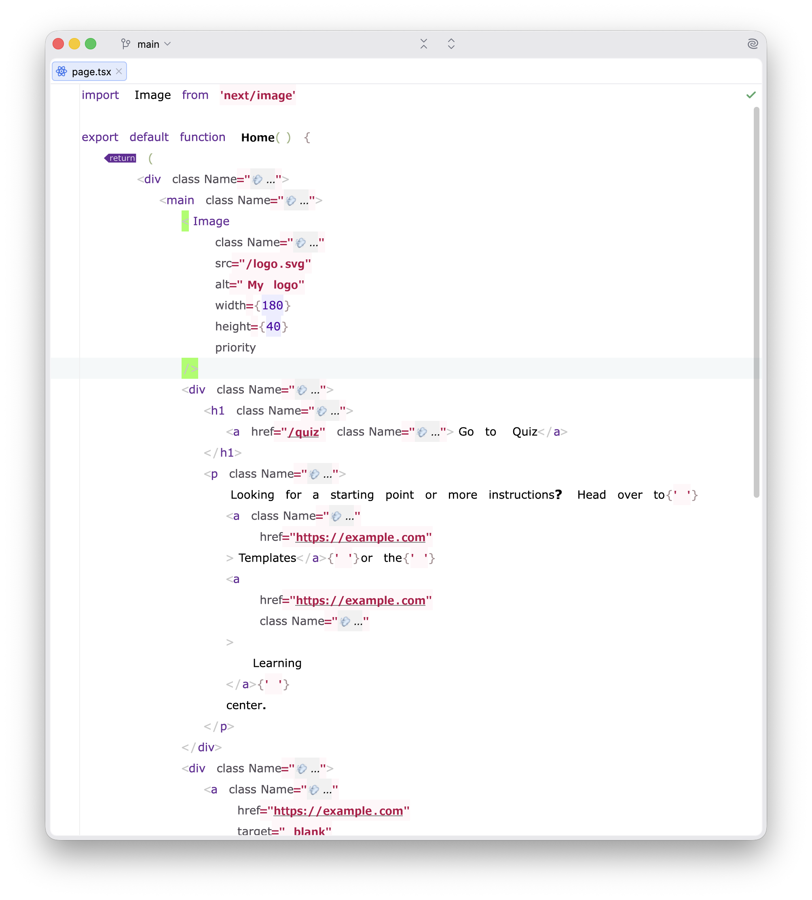
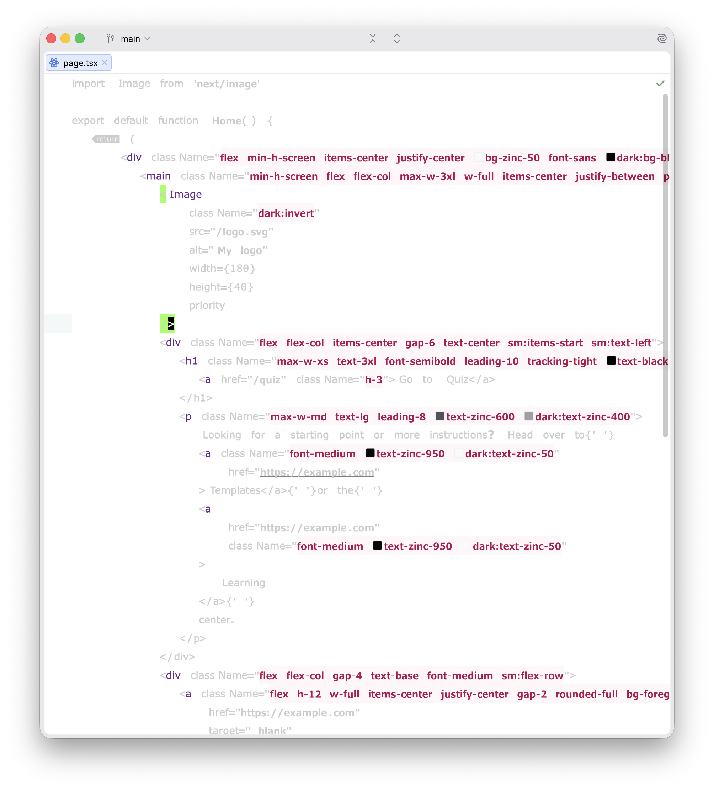
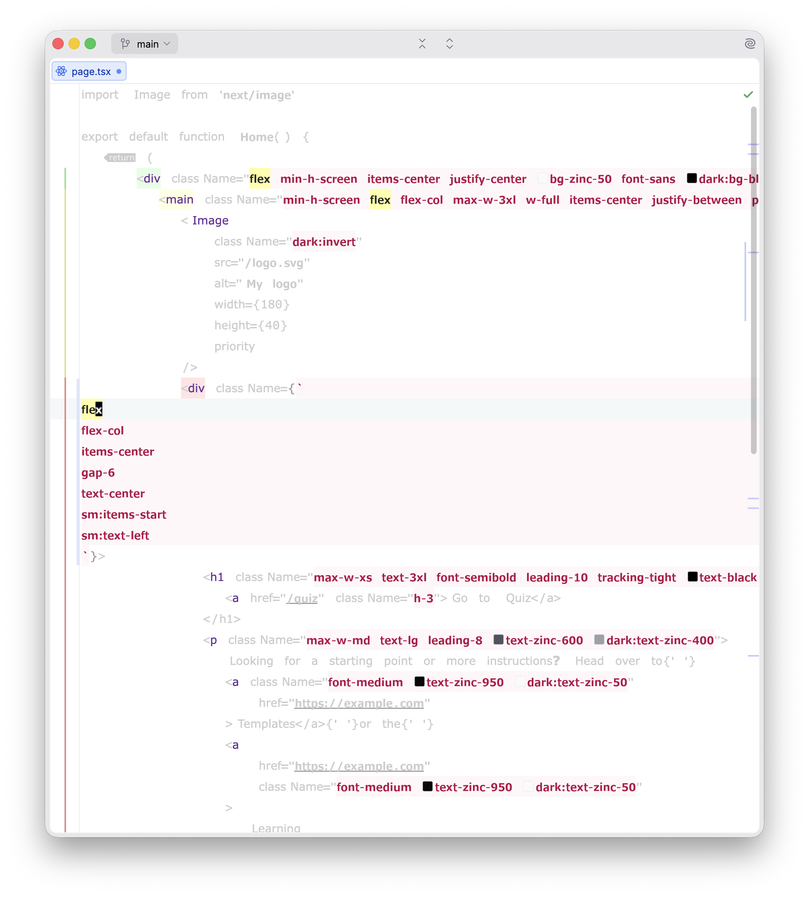
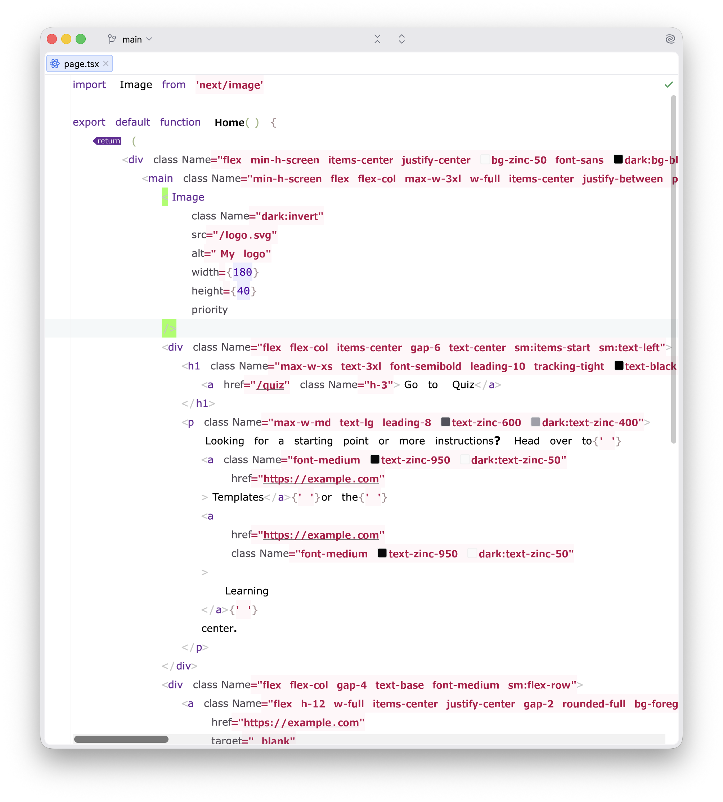

# Tailwind Eye
A WebStorm extension that provides a visual fading or folding effect for code. It can toggle between fading non-styling
code (to focus on Tailwind classes) and folding the content of `className` strings.

## Demo


## Fold


## Dim


## Edit multiline


## Off



## Motivation
To reduce visual noise and focus on what matters, whether it's the structure of your HTML/JSX or the Tailwind styling
itself.

<!-- Plugin description -->
Use the shortcut `Shift + Alt + F` to toggle between the two modes:
- **Fade non-styling code**: Fades everything except `className` attributes.
- **Fold className content**: Folds the actual Tailwind utility strings.

<!-- Plugin description end -->


## Installation

- Using the IDE built-in plugin system:

  <kbd>Settings/Preferences</kbd> > <kbd>Plugins</kbd> > <kbd>Marketplace</kbd> > <kbd>Search for "tw-eye-tmp"</kbd> >
  <kbd>Install</kbd>

- Using JetBrains Marketplace:

  Go to [JetBrains Marketplace](https://plugins.jetbrains.com/plugin/MARKETPLACE_ID) and install it by clicking
  the <kbd>Install to ...</kbd> button in case your IDE is running.

  You can also download the [latest release](https://plugins.jetbrains.com/plugin/MARKETPLACE_ID/versions) from
  JetBrains Marketplace and install it manually using
  <kbd>Settings/Preferences</kbd> > <kbd>Plugins</kbd> > <kbd>⚙️</kbd> > <kbd>Install plugin from disk...</kbd>

- Manually:

  Download the [latest release](https://github.com/ericfortis/tw-eye-tmp/releases/latest) and install it manually using
  <kbd>Settings/Preferences</kbd> > <kbd>Plugins</kbd> > <kbd>⚙️</kbd> > <kbd>Install plugin from disk...</kbd>


Plugin based on the [IntelliJ Platform Plugin Template][template].

[template]: https://github.com/JetBrains/intellij-platform-plugin-template

[docs:plugin-description]: https://plugins.jetbrains.com/docs/intellij/plugin-user-experience.html#plugin-description-and-presentation

---

## How to Build and Install

### 1. Build the Plugin
This project uses Gradle. To compile the plugin and create an installable distribution, run:
```bash
./gradlew buildPlugin
```
The resulting ZIP file will be located in:
`build/distributions/tailwind-eye-1.0-SNAPSHOT.zip`

### 2. Install in your IDE
To install the plugin in your personal IDE (not the sandbox):
1. Open your IDE (WebStorm, IntelliJ IDEA, etc.).
2. Go to **Settings** (or **Preferences** on macOS) > **Plugins**.
3. Click the **cog icon** (⚙️) and select **Install Plugin from Disk...**.
4. Navigate to the `build/distributions/` folder and select the ZIP file.
5. Restart the IDE if prompted.

## Development
To run a development instance of the IDE with the plugin pre-installed:
```bash
./gradlew runIde
```
